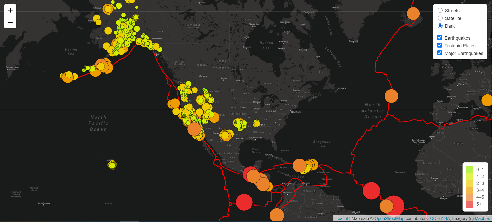

# Mapping Earthquakes

## Project Overview
Disaster Reporting Network, a non-profit company that provides data-driven storytelling on disasters around the world. Disaster Reporting Network wants to build insightful data visualizations with interactive features on earthquakes from around the world. Basil, the head of the earthquake disaster response team believes that this project will be useful for his team which includes reporters and Data Visualization specialists. Also, he hopes that earthquake maps will be informative and easy to use on desktop and mobile phones. The website and mobile application will be created using the latest earthquake GeoJSON data from the U.S. Geological Survey website. The earthquake data will be retrieved using JavaScript and the D3 leaflet libraries and data will be plotted on a Mapbox map through an API request. The following will be added on the map: 

1. The magnitude and location of each earthquake in the popup marker.
2. The diameter and color of the markers for each earthquake will reflect the magnitude of the earthquake.
3. The legend will be providing the context for the map data.
4. Tectonic plates fault lines will be added to illustrate the relationship between the location and frequency of seismic activity. 

The purpose of this project is to build insightful data visualizations with interactive features for earthquakes around the world.

## Result
Web Application Overview: 
